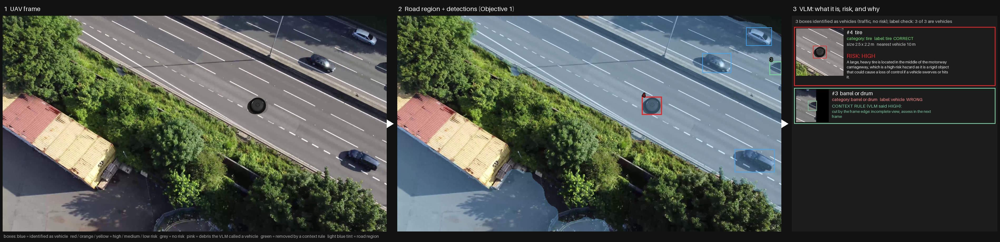
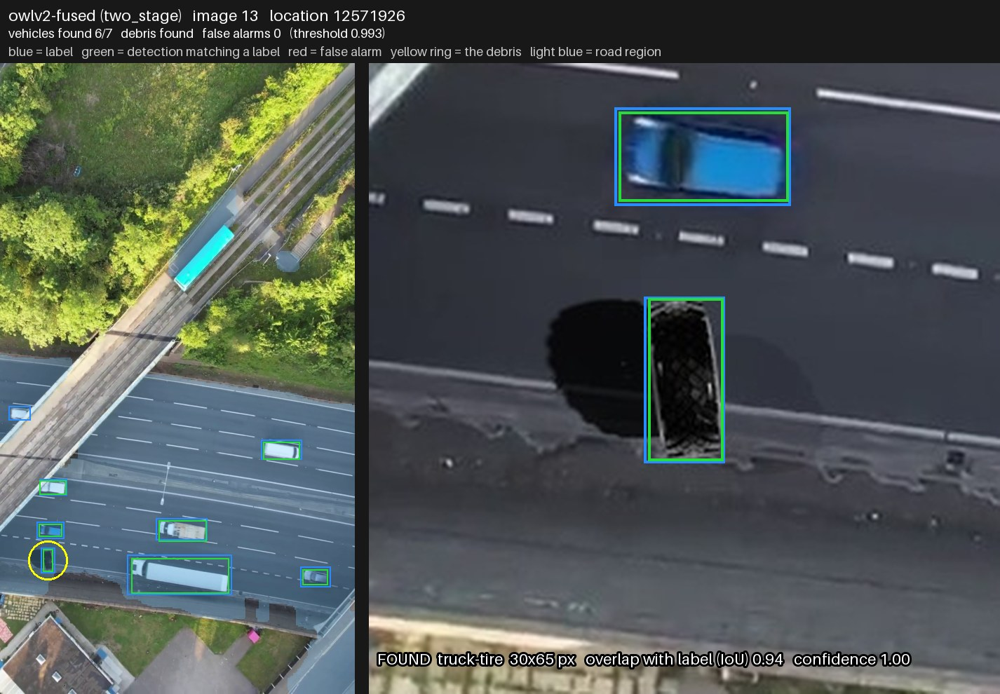

# UAV-VisualSurv

**Seeing hazards on the highway from a drone.** A perception pipeline that
finds every vehicle and every piece of fallen debris on a motorway in UAV
imagery, then says what each object is, how dangerous it is, and why.
It runs on a 4 GB laptop GPU.



*One test frame through the whole chain. The detector finds the tyre and
the traffic. The vision-language model names the tyre and rates it high risk
("a large, heavy tire in the middle of the carriageway..."). A car cut by
the frame edge is set aside by the context gate instead of raising a false
alarm.*

## How it works

```text
UAV frame
  -> 1  road region      SegFormer-B2 fine-tuned on drone imagery (AeroScapes)
  -> 2  what is there    OWLv2 objectness on tiles + a learned re-scorer, class-agnostic
  -> 3  what it is       a vision-language model names each box; a physics check
                         rejects names that do not fit the measured size
  -> 4  context gate     frame edge, distance from traffic, detector opinion,
                         vehicle parts: false alarms never reach step 5
  -> 5  how risky        the VLM rates each hazard high / medium / low, with reasoning
```

## Results

The evaluation set is 30 real drone frames of open motorway with rendered
debris, 342 hand-checked vehicles and 30 debris objects. Settings are chosen on
a separate set of 30 frames.

| | result |
|---|---|
| vehicles found (step 2) | 95.2% |
| debris found (step 2) | 90.0% |
| detection precision | 84.1% |
| debris named correctly by the local 2B VLM (step 3) | 56% (tyres 7 of 9) |
| false alarms sent to risk assessment (step 4) | 34 -> 1 |
| end-to-end time | about 55 s per 4K frame on an RTX 3050 Ti (4 GB) |



Three ways of running steps 3 to 5 (local model, local model + context gate,
commercial VLM) are compared in [results/pipeline_report.md](results/pipeline_report.md).

## Repository

| | |
|---|---|
| `scripts/` | every step, from dataset synthesis to evaluation and figures |
| `results/` | metrics (JSON), figures, the pipeline report |
| `docs/` | model and dataset sources, licences |

Datasets and model weights are not in the repository. The download and build
scripts below fetch or regenerate them.

The rest of this README is the full technical record: benchmark design,
dataset construction, every experiment and why each decision was made.

---

## Benchmark background

Detect objects that do not belong on a highway surface, from a UAV camera.
The class is never required as output — a tire, a box, a metal sheet and an
unseen object are all just `suspicious_object`.

The target task needs three things at once: **UAV viewpoint**, **highway
scene**, **small real physical object**. No public dataset has all three. Every
dataset here has exactly two, so a single leaderboard would confound viewpoint,
object size and anomaly type.

The benchmark is therefore **factorial**: six test beds, each holding two
factors fixed and moving one, so a drop can be attributed to a cause.

Results deck: `results/uav_selection_report.html`.

## Status

| Stage | State |
|---|---|
| Environment (Python 3.12) | done |
| Models — 8 checkpoints + fine-tuned road segmenter + re-scorer, 6.5 GB | done, VRAM verified |
| Datasets — 13 sets, 20.2 GB | done |
| Smoke test on real imagery | done |
| Factorial benchmark, 4 methods x 6 test beds | done |
| Input-resolution sweep | done |
| Sample overlays + slide report | done |
| Synthetic highway set | done, 30 images, 342 vehicles + 30 debris, labels reviewed by hand |
| Vehicles + debris on the road | done, v2 (road mask + OWLv2 + re-scorer): vehicles 95.2%, debris 90.0%, precision 84.1% |
| Objective 2: identify + assess risk | paths 1-2 done (results/pipeline_report.md); local 2B VLM names 56% of debris right, 96% of vehicles; path 2 cuts false risk alarms 34 -> 1; path 3 (commercial VLM) pending |

## The six test beds

Object size is **measured** (median object area as a fraction of the scored
region), not eyeballed. That measurement reordered the sets: a FOD-A bolt looks
tiny but fills 4.4% of its 300x300 frame — 27x more than a SMIYC obstacle. It
is what makes B3 -> B4 a clean viewpoint contrast.

| | View | Scene | Object size | Anomalous / frame | Images | Source |
|---|---|---|---|---|---|---|
| B1 | ground | road | 0.16% | 10.6% | 70 | RoadAnomaly-EPFL + SMIYC Anomaly21 |
| B2 | ground | road | 0.15% | 0.7% | 30 | SMIYC RoadObstacle21 |
| B3 | near-ground | runway | 4.40% | 8.6% | 120 | FOD-A |
| B4 | UAV ~10 m | rail corridor | 3.67% | 7.7% | 120 | UAV-RSOD |
| B5 | UAV high | streets | 20.4% | 42.7% | 23 | RescueNet |
| B6 | UAV mixed | urban + highway | — | none | 76 | UAVDT |

Contrasts: **B3 -> B4** viewpoint (object size and background matched, only
the camera moves) · **within B1, by size** object size · **B6** false alarms on
the only test bed that is actually in the target domain.

B5 is scored but kept out of the report: hurricane debris on residential
streets is too far from a highway to inform the choice. It is retained as the
one set where anomalies are the *majority* of the road — the regime where a
prototype-distance method's premise inverts.

## Two rules that make the numbers comparable

1. **Raw scores, no per-image min-max.** Rescaling each frame to 0–1 puts a
   maximum-score pixel in every frame, so a clean frame always alarms and B6
   becomes meaningless. AUROC is rank-based and would not notice; every
   threshold-based number would be wrong.
2. **Compare at a matched false-alarm rate.** Each method's threshold is set on
   the clean pixels of the benchmark being scored, to spend exactly 1% of the
   scored area. One shared threshold lands at wildly different false-alarm
   rates per method and per scene, so it measures who was allowed to fire more.

Two silent failures were worth more than any tuning:

- **Tie handling.** Grounding DINO's score map is one constant per box and 0
  elsewhere; ranking positives first inside a tie gave it AUROC 1.000 on B3
  that no threshold could deliver. Collapsing tie blocks to their last index
  dropped it to 0.781.
- **Processor override.** Both DINO image processors default to shortest-edge
  256 + centre crop 224, silently undoing any resize done beforehand. PROWL ran
  on a 16x16 patch grid, where a small road obstacle is a *fraction of one
  patch*. Forcing `do_resize`/`size`/`do_center_crop` in the call is what makes
  the input size mean anything — and it more than doubled B2 recall.

## Headline results

Object recall with each method's threshold set on **that benchmark's own clean
pixels** at 1% false-alarm area. Comparing at one shared threshold compares who
was allowed to fire more, not who ranks anomalies better.

| recall @ 1% FP | B1 ground | B2 ground | B3 near-ground | B4 aerial | B6 clean (FP area) |
|---|---|---|---|---|---|
| **PROWL · DINOv2** | **36%** | **89%** | **98%** | **94%** | 0.12% |
| PROWL · DINOv3 | 17% | 36% | 97% | 81% | 0.14% |
| RbA · SegFormer | 32% | 80% | 85% | 61% | 7.70% |
| Grounding DINO | 4% | 27% | 12% | 2% | 0.00% |

AUROC follows the same order (DINOv2: 0.922 / 0.992 / 0.938 / 0.892).

- **Input resolution is the dominant factor, and it is a free parameter.**
  The self-supervised methods see an image as a `side/patch` grid; an object
  smaller than one cell shares a vector with the road around it. On B2 the
  median object covers **2.2 cells** at 896px input. Sweeping only the input
  size on B2 — nothing else changed — moves recall 36% → 60% → 76% → **89%**
  (224 / 448 / 672 / 896) and AUROC 0.836 → **0.992**, for 0.58 → 0.69 GB of
  VRAM against a 4 GB budget. See `results/resolution_sweep.json`.
- **Self-supervised prototype distance wins on every benchmark.** It asks "does
  this region look like the rest of this frame", which needs no prior about
  what objects or scenes exist, so it survives a viewpoint it has never seen.
- **Viewpoint cost tracks what a method depends on.** B3 → B4 costs DINOv2 4
  points, Grounding DINO 10 (from a floor of 12%), RbA 24. RbA's criterion is
  "none of Cityscapes' 19 classes explain this", and those classes do not hold
  in a nadir view; Grounding DINO must first recognise the object, whose shape
  changes completely from above.
- **Object pixel count matters within a fixed setup too.** Inside B1 alone —
  same images, masks, viewpoint and scene — recall rises monotonically with
  object size for all four methods (RbA 3% → 94%).
- **False-alarm rate is a cost, not a verdict.** It is measured against each
  dataset's own annotation. A method that flags a real hazard the dataset did
  not label is scored as a false alarm here, so no method is excluded on that
  number alone; the full recall/false-alarm curve is the honest comparison.
  On B6 the alarms land on billboards, roadside buildings and vegetation rather
  than the carriageway — a road-region mask would remove most of them.
- **Thresholds do not transfer across scenes.** Every family's score scale
  drifts with the scene, so calibration has to be redone in the domain you fly
  in; it is not a one-time step.

Caveat that travels with all of it: **no test bed is the target domain.** B4 is
rail, not highway; B6 is highway with no anomalies. UAV-RSOD and FOD-A are
box-annotated, which inflates absolute recall (ranking stays valid). All runs
are zero-shot.

## The binding constraint: 4 GB VRAM

GPU is an RTX 3050 Ti Laptop. Disk is not the bottleneck — VRAM is. Measured,
not estimated: `python scripts/check_models.py`, results in
`results/vram_check.json`.

**The 4 GB limit is soft, and that is a trap.** Windows falls back to shared
system memory instead of raising OOM, so an oversized model still "works" — it
just crawls. Measured on SegFormer-B2:

| | peak | per megapixel |
|---|---|---|
| 1024x1024 | 0.92 GB | 158 ms |
| 4096x2160 | 7.36 GB | **1358 ms — 8.6x slower** |

No error, no warning. **Treat a peak above ~3 GB as a failure**, not the
absence of an OOM.

| Model | 1024x1024 | 4096x2160 |
|---|---|---|
| segformer-b0-cityscapes | 0.31 GB | **2.50 GB — fits** |
| segformer-b2-cityscapes | 0.92 GB | 7.36 GB — spills |
| mask2former-swin-tiny | 0.64 GB | 4.67 GB — spills |
| dinov2-large | 0.79 GB | **1.89 GB — fits** |
| dinov3-vitl16 | 0.74 GB | **1.49 GB — fits** |
| grounding-dino-tiny (fp32) | 2.02 GB | OOM |
| sam2.1-hiera-base-plus | 0.40 GB | n/a — fixed 1024 input |

Measured peaks for the methods as they actually run in `benchmark.py`
(these are what the budget has to cover, not the table above):

| method | input | peak | s/image |
|---|---|---|---|
| PROWL · DINOv2 | 896x896 | 0.69 GB | 0.44 |
| PROWL · DINOv3 | 896x896 | 0.65 GB | 0.36 |
| RbA · SegFormer-B2 | 512x512 | ~0.6 GB | 0.09 |
| Grounding DINO (fp32) | 1024 long side | ~3.5 GB | 0.6-0.9 |

**The budget was never the binding constraint for PROWL** — it was running at
0.58 GB on a 224px crop because of the processor bug below. Raising it to 896
costs 0.11 GB and more than doubles small-object recall.

Three silent failures, none of which raised an error:

- **DINOv3 returns 100% NaN in fp16**, with the right shape and no warning.
  Use `bfloat16` — same memory, fp32's exponent range. A random-noise VRAM
  check cannot catch this; only looking at the values can.
- **Grounding DINO must stay fp32.** Autocast peaked *higher* than plain fp32
  (3.81 vs 3.49 GB) because it keeps fp32 master weights.
- **The DINO image processors override any resize done beforehand** (defaults:
  shortest-edge 256 + centre crop 224). Pass `do_resize`, `size` and
  `do_center_crop` in the processor call or the input size is silently ignored.

## Quick start

```powershell
. d:\UAV_VisualSurv\scripts\env.ps1        # always first
python scripts\download_models.py
python scripts\download_datasets.py
python scripts\benchmark.py                # -> results/benchmark.json
python scripts\benchmark_figures.py        # -> results/figures/B1..B6.jpg
python scripts\make_report.py              # -> results/uav_selection_report.html
```

`env.ps1` selects the Python 3.12 venv and redirects all caches to D:. The
system default `python` is 3.14 and has no PyTorch wheels.

`PIP_CACHE_DIR` and `TMP` are independent settings: pip stages wheels through
`TMP` before caching them, so redirecting only the cache still leaves a full
copy on C:. `env.ps1` sets both. Environment variables apply only to processes
started afterwards.

## Layout

```
scripts/
  env.ps1                 venv + cache redirection
  download_models.py      registry + downloader, records commit SHA
  download_datasets.py    registry + downloader
  check_models.py         VRAM measurement across resolutions
  smoke_test.py           "is this obviously broken?" on real imagery
  benchmark.py            the factorial benchmark      -> results/benchmark.json
  resolution_sweep.py     input size vs recall on B2   -> results/resolution_sweep.json
  benchmark_figures.py    sample frames, all methods overlaid -> results/figures/
  make_report.py          slide report, every number read from the JSON
  highway_backgrounds.py  open-highway background pool, with exclusion reasons
  calibrate_vehicle_scale.py  pixels per metre per shoot location
  render_debris.py        Blender: one debris render, with and without shadow
  build_synthetic_dataset.py  composite debris into backgrounds
  add_vehicle_labels.py   vehicle proposals + manual review -> vehicle labels
  train_road_segmenter.py Stage 1: SegFormer-B2 fine-tuned on AeroScapes
  eval_road_objects.py    Stage 1 + Stage 2 on the synthetic set -> results/road-object-eval/
  build_training_renders.py   separate renders for training the re-scorer
  train_rescorer.py       Stage 2 re-scorer: probe on OWLv2 features, leave-one-location-out
  draw_detection_examples.py  labels vs detections -> results/synthetic-debris-inference/
  assess_risk.py          Objective 2: VLM identification + physics check + context gate + risk -> results/risk-assessment/
  time_pipeline.py        end-to-end timing and GPU memory per path -> results/risk-assessment/<path>/timing.json
datasets/                 raw data, never modified in place
models/                   weights + manifest.json (repo, commit SHA, licence)
results/                  benchmark.json, resolution_sweep.json, figures/,
                          uav_selection_report.html, vram_check.json
docs/                     models.md, datasets.md — sources, licences, decisions
requirements.txt          Python deps (install torch separately, see below)
.venv/ .cache/            tooling, ignore
```

`compare_models.py`, `eval_transfer.py` and `draw_detections.py` are superseded
by `benchmark.py` and `benchmark_figures.py` and can be deleted.

## Environments

Two are needed and cannot be merged — the `detectron2` stack that
Mask2Anomaly, RbA and JSR-Net pin conflicts with current `transformers`.

**Windows, Python 3.12** — foundation models, data prep, evaluation:

```powershell
d:\UAV_VisualSurv\.venv\Scripts\python.exe -m pip install torch torchvision --index-url https://download.pytorch.org/whl/cu124
d:\UAV_VisualSurv\.venv\Scripts\python.exe -m pip install -r requirements.txt
```

**WSL2 Ubuntu 22.04** — detectron2 models. Not yet provisioned.

## Reproducibility

`models/manifest.json` records the resolved **commit SHA** per checkpoint, not
a branch name. Raw datasets are never modified in place. The report is
generated from `results/benchmark.json` — no number is retyped, so the deck
cannot drift from the run that produced it.

## Synthetic highway set

`datasets/synthetic-highway-debris/`: 30 real UAV frames of open highway,
one rendered piece of debris in each, and every vehicle labelled. Rebuilt on
2026-09-24; it replaces the earlier 100-image version (a copy of that one is
in `.cache/tmp/synthetic-highway-debris.v1`).

| | |
|---|---|
| images | 30, from 4 shoot locations |
| vehicles labelled | 342 (median short side 33 px) |
| debris objects | 30, 12 categories |
| frame sizes | 1080x1920 and 3840x2160 |

- **Open highway only.** The project scope rules out oblique, distant and toll-station
  views. Of the 16 candidate locations, 4 pass, all drone clips from Pexels
  (`highway_backgrounds.OPEN_HIGHWAY`). Every UAVDT and VisDrone location
  fails: toll plazas, or oblique views with the horizon in frame. The reason
  for each exclusion is kept in `highway_backgrounds.EXCLUDED`. Two clips
  were added for this (Pexels 12306893 and 8742752).
- **Debris** is 22 CC-licensed Sketchfab models rendered in Blender at real
  size. Pixels per metre is calibrated per location from the cars in frame.
- **Scale is exact.** The render is scaled by the ratio of the background's
  and the render camera's pixels per metre. The previous version scaled the
  render's alpha extent, which is mostly soft shadow, so every object came
  out at about a third of its real size.
- **Debris labels exclude the shadow.** Blender renders each object twice,
  once with its shadow for the image and once without it for the mask and
  box. A dark shadow is as opaque as the object, so no alpha threshold could
  separate the two, and a truck tyre's box used to be twice the tyre's width.
- **Placement follows traffic.** Debris goes into the lane of a real
  vehicle, 1.2 to 4 vehicle lengths ahead of or behind it. The road
  segmenter must agree at the point and along the straight line back to the
  vehicle. 28 of 30 were placed this way. On two 8742752 frames the
  Cityscapes segmenter called a container yard road and missed most of the
  motorway, so the point was picked by hand on a lane (manifest placement
  `manual`).
- **Vehicle labels were checked by hand.** Pexels footage has no annotation
  anywhere. Grounding DINO proposes vehicles on 800 px tiles at threshold
  0.22, and every proposal was checked by eye: 293 kept, 49 missed vehicles
  added by hand, and false ones dropped (signs, lamp bases, pallets,
  pedestrians on a footpath). The decisions live in
  `vehicle_label_review.json`, so `add_vehicle_labels.py` rebuilds the same
  labels. Hand-added boxes are approximate, which the hit criterion
  (IoU > 0.1) tolerates.
- **Ignore regions.** Vehicles on an overpass or a side road, and the
  parking lots and service roads beside the static-camera clip, are neither
  targets nor false alarms.

Rebuild order:

```powershell
python scripts\highway_backgrounds.py              # lists the pool
python scripts\calibrate_vehicle_scale.py
python scripts\add_vehicle_labels.py --backgrounds # vehicle proposals per background
python scripts\build_synthetic_dataset.py --n 30
python scripts\add_vehicle_labels.py               # applies the manual review
```

## Finding vehicles and debris on the road

```text
UAV frame
  -> Stage 1: drone-view road segmenter -> drivable mask (holes filled, dilated)
  -> Stage 2: OWLv2 on overlapping tiles, two size-routed scales -> class-agnostic boxes,
              each with an objectness score and a 512-d feature
  -> re-scorer: a linear probe on that feature -> "target on the road" probability
  -> keep a box if it is on the road and
       (probe >= threshold) or (objectness >= 0.15 and probe >= 0.5)
```

Current results, two-stage, mean of the two held-out halves:

| | vehicles found | debris found | precision |
|---|---|---|---|
| **v2: road mask + OWLv2 + re-scorer** | **95.2%** | **90.0%** | **84.1%** |
| v1: road mask + OWLv2 objectness | 94.5% | 76.7% | 78.2% |
| v2 at the strict overlap (IoU > 0.5) | 92.8% | 80.0% | 81.3% |
| v1 at the strict overlap (IoU > 0.5) | 90.2% | 63.3% | 73.9% |

Target was debris at least 90% and vehicles at least 95%. Both are met, but
only just: debris is 27 of 30 on the held-out halves, and small changes to
the pipeline moved vehicle recall between 94.8% and 95.4% during this work.
False alarms fall from 97 to 62 over the 30 images.
End-to-end speed is about 4 s per frame at a 2.19 GB VRAM peak.

### What changed from v1, and why

Each change came from sorting v1's misses and false alarms by cause:

| v1 failure | count | fix |
|---|---|---|
| Vehicles outside the road mask | 12 | mask fixes below |
| Debris found but scored below threshold | 7 | re-scorer |
| Vehicles scored below threshold | 5 | re-scorer + objectness gate |
| False alarms on lamps, gantries, signs, cabinets, footpath people | 84 of 97 | re-scorer |

- **The road mask ate its own border.** The morphological closing treated
  everything outside the frame as "not road", so vehicles cut by the frame
  edge fell outside it. The mask is now edge-padded first.
- **Trucks are holes in the road mask.** AeroScapes vehicles are mostly
  cars, so the segmenter calls a truck body "not road". A box now counts as
  on the road if its centre is, or if at least half of a ring around it is.
  Together the two fixes lift Stage 1 vehicle coverage from 95.9% to 98.2%.
- **Long trucks never had a box.** v1 dropped every box longer than 35% of a
  tile, to remove lane-sized boxes, which also removed car transporters. v2
  adds a coarse whole-short-side scale that only keeps large boxes, while the
  fine tiles keep the small ones.
- **Objectness alone cannot rank the hard debris.** Every debris object has
  an OWLv2 box on it, but a flat mattress scores 0.08 and a street lamp
  0.3. Asking OWLv2's text head to recognise known background ("a street
  lamp", "a road sign") did not help: debris matched those queries as
  strongly as the real lamps did. What works is learning from examples.
- **The re-scorer** (`scripts/train_rescorer.py`) is a logistic regression
  on each box's OWLv2 feature, trained only on separate renders
  (`scripts/build_training_renders.py`). These are 30 more frames from the
  same open-highway pool, never used by the test set, with 3 debris objects
  each. It is trained with motion-blur copies of every vehicle, because the
  static-camera clip's traffic is heavily blurred and nothing else in the
  training data is.
- **Why the objectness gate.** The re-scorer is tested leave-one-location-out
  (below) and under-scores blurred traffic from a location it has not seen.
  Objectness was reliable on vehicles all along, so a box that passes v1's
  objectness threshold is kept unless the re-scorer rejects it. Neither
  gate value (0.15 from v1's held-out threshold, 0.5 the probability
  midpoint) was tuned here.

**How the re-scorer is kept honest.** The 30 test images are never trained
on. The training renders come from the same four clips as the test frames,
so the test images of each location are scored by a probe trained only on
the other three locations' renders. Its regularisation is chosen the same
way, inside the training renders. The one free threshold is picked on half
the test images and scored on the other half, as for every method. The
deployable probe, trained on all four locations, is saved in
`models/owlv2-rescorer/` as plain arrays (`probe.npz`, `config.json`).

**What is still missed.** Four debris objects, all small or flat: two
mattresses, two suitcases, 13 to 30 px on a side. About 16 of 342 vehicles
are missed. Most are a strongly sunlit, oblique frame where the road mask
covers only part of the carriageway, or motion-blurred trucks. Four cars
queued nose-to-tail get one box around all of them, which counts as a miss
for each car.

### Earlier comparison (v1 stage)

| Stage 2 + Stage 1 | vehicles found | debris found | precision | s/image |
|---|---|---|---|---|
| OWLv2 + drone road mask (v1) | 94.5% | 76.7% | 78.2% | 3.1 |
| OWLv2, two tile sizes + drone road mask | 94.4% | 66.7% | 80.9% | 15.3 |
| OWLv2, no road mask | 97.0% | 66.7% | 68.0% | 3.1 |
| OWLv2 + Grounding DINO road boxes | 81.1% | 56.7% | 79.2% | 3.1 |
| DINOv2 tiled prototype distance + drone road mask | 39.8% | 50.0% | 3.8% | 5.9 |

Stage 1 on its own:

| | vehicles inside | debris inside | share of frame |
|---|---|---|---|
| drone road mask, v2 rules | 98.2% | 100% | 43% |
| drone road mask, v1 rules | 95.9% | 100% | 42% |
| Grounding DINO road boxes | 82.5% | 83.3% | 49% |

- **Stage 1 is SegFormer-B2 fine-tuned on AeroScapes** (real drone footage),
  with road plus car as the positive class
  (`scripts/train_road_segmenter.py`, 38 min, 2.18 GB peak, AeroScapes val
  IoU 0.90; the Cityscapes weights scored 0.31 on road alone). Saved in
  `models/segformer-b2-aeroscapes-road/`.
- **The road mask pays for itself only when it is accurate.** Grounding
  DINO's boxes covered anywhere from 2% to 92% of frames from one location
  and lost 17% of the objects outright.
- **Prototype distance does not fit this scene.** DINOv2 asks "what looks
  unlike the rest of the frame". On a busy motorway the vehicles are a large
  part of the frame, and its thresholded map breaks into about 130 boxes per
  image at 3.8% precision.
- **Metrics.** Recall is the share of labels found (IoU > 0.1 unless stated,
  one-to-one). Precision is the share of boxes that hit a label. The
  threshold maximises the F1 of precision and the mean of vehicle and debris
  recall, so 342 vehicles cannot drown out 30 debris.

### Figures and commands

`results/synthetic-debris-inference/` has one figure per image, found or
missed, with the road region tinted light blue, plus `summary.json`.
`results/road-object-eval/examples/` repeats six frames with large debris.
Blue boxes are labels, green boxes are detections that hit a label, and red
boxes are false alarms. The figures use the threshold chosen on all 30
images: 326 of 342 vehicles, 26 of 30 debris, 62 false alarms (v1: 324, 23,
97).

```powershell
python scripts\train_road_segmenter.py                        # once, ~40 min
python scripts\build_training_renders.py --per-image 3        # once, ~30 min (Blender)
python scripts\train_rescorer.py                              # features, probe, scores -> results/road-object-eval/
python scripts\draw_detection_examples.py --method owlv2-fused --which two_stage --all
python scripts\draw_detection_examples.py --method owlv2-fused --which two_stage
```

**Limits.** These are 30 images from 4 locations, and each debris object is
3.3 points of debris recall, so the debris figure is coarse: 27 of 30 has a
95% range of roughly 74% to 97%. The debris is rendered, not real, and the
training renders use the same 3D models as the test set, so a new kind of
object is untested. Vehicle labels are reviewed detector proposals plus
hand-drawn boxes, not a professional annotation. The operating threshold was
chosen on these 30 images; a new location will need its own check.

## Objective 2: what each detection is, and how risky

```text
UAV frame
  -> Objective 1 (road mask + OWLv2 + re-scorer): class-agnostic boxes on the road
  -> VLM, per box: describe it, then pick a category          (Qwen3.5-2B, 4-bit, local)
  -> physics check: is that category possible at the measured size? if not, ask again
  -> VLM, per debris or person: risk level + written reasoning, from measured facts
  -> vehicles and roadside structure: risk "none" by rule
```

`scripts/assess_risk.py`. Three paths are compared in
`results/pipeline_report.md` (accuracy, per-stage time, GPU memory, deployment
cost), which is updated as each path lands. Each path has its own folder in
`results/risk-assessment/`, holding one `NN_chain.jpg` per test image,
`per_image/NN.json` with every box's answer, reasoning and label check,
`summary.json` and `timing.json`:

| folder | path |
|---|---|
| `path1_qwen_local/` | local Qwen, answers taken as they are |
| `path2_qwen_relations/` | local Qwen + context gate before the risk step (final, round 2) |
| `path2_qwen_relations_round1/` | the same, round 1: the clean held-out run |
| `dev/` | the same runs on the training renders, where rules were chosen |

**Path 2's context gate** removes a candidate from risk assessment, and never
adds one, when any of these holds:
- it is cut by the frame edge;
- it is more than 12.5 m sideways from every lane with traffic;
- Objective 1's own box feature rules out debris;
- it is part of a vehicle (a small box wholly inside one, or the VLM confirms
  it when asked directly), or the cab or trailer of an articulated vehicle.

On the test set it cut false boxes sent to risk assessment from 34 to 1
without losing any debris; details and caveats are in the report. Green boxes
and cards in the path-2 figures are candidates the gate removed, with the
reason.

**Reading a chain figure.** Panel 1 is the frame. Panel 2 is Objective 1's
road region (light blue tint) and detections. A box's colour is the VLM's
verdict: blue for vehicle, red, orange or yellow for high, medium or low risk,
grey for no risk, and pink for debris the VLM called a vehicle. Panel 3 has
one card per non-vehicle box, hazards first. Each card shows a zoom, the
VLM's name and category, a label check (CORRECT or WRONG against the
dataset label), the measured size and the distance to the nearest vehicle,
any physics correction, the risk level and the VLM's reasoning.

### Results on the 30 test images

| | result |
|---|---|
| debris named with the right category | 56% (14 of 25) |
| tyres named "tire" | 7 of 9 |
| debris sent to risk assessment at all | 84% (21 of 25) |
| vehicles named "vehicle" | 96.0% (316 of 329) |
| vehicles and false alarms turned into a hazard | 7.6% |
| time per VLM call / peak VRAM | 2.7 s / 1.97 GB |

**This is far from the target of near-100% identification.** The binding
constraint is the 4 GB card: the largest VLM that fits is a 2-billion-
parameter model, and the objects are 13 to 170 px on a side. Its mistakes
are mostly flat or boxy debris (fridges, mattresses, pallets) taken for road
equipment or "other debris", parts of vehicles taken for a person or a
tyre, and one truck tyre taken for a car. Every mistake is visible in the
figures as a WRONG label check or a pink box.

### How the settings were chosen

All choices were made on 210 boxes from the training renders
(`datasets/synthetic-highway-debris-train`): 90 debris, 60 vehicles and 60
false-alarm-like boxes. The test images were not used. The score is the
mean of debris named right, debris sent to risk assessment, vehicles named
right, and one minus the share of other boxes wrongly turned into a hazard.
Calling a road marking a "person" counts as a false hazard, because it
triggers a high-risk alarm.

| variant (Qwen3.5-2B, 4-bit) | debris named | debris sent to risk | vehicles | false hazards | score |
|---|---|---|---|---|---|
| category menu, answer as JSON | 42.2% | 75.6% | 95.0% | 17.5% | 0.738 |
| describe first, then category | 40.0% | 84.4% | 95.0% | 20.0% | 0.749 |
| **describe first + physics check** | **45.6%** | **82.2%** | **93.3%** | **18.3%** | **0.757** |

Tried and dropped:

- **Qwen3.5-4B.** Its tied 248k-token embedding is 1.27 GB in bf16, which
  bitsandbytes cannot quantise. Even with the vision tower quantised it
  peaked at 3.5 GB and spilled into shared memory, at 11.6 s per box.
- **8-bit instead of 4-bit.** It was slower and, for the 2B model, no more
  accurate.
- **A two-level multiple choice read from letter probabilities.** The 2B
  model ignores "answer with the letter only". Even with the answer
  prefilled, it put almost all debris under "road equipment or marking".
- **Qwen3.5's thinking mode.** It took 38 s per box, often ran out of tokens
  before answering, and named only 9 of 30 debris right.

### The physics check

The VLM has no sense of scale. It called a 2.8 m white car a "cardboard
box". Every box has a measured size: its pixels divided by the location's
ground resolution. A category is ruled out when the box's longest side
exceeds that category's real-world maximum times 1.75. The 1.75 covers an
axis-aligned box around a square object turned 45 degrees (x 1.4) and
ground-resolution error (x 1.25). A vehicle needs at least 1.5 m. A
ruled-out answer is asked again with the impossible categories removed.

On the test set it made 48 corrections. Debris named right rose from 44% to
56%, and vehicles named right from 93.3% to 96.0%. This is the "physical
understanding" the project aims for, in its simplest form: a measurement
overrules the language model. It cannot separate a tyre from a car here,
because the dataset's tyres are rendered up to twice real size (a user
request in Objective 1), so tyre and small-car sizes overlap.

### Risk step

For each box named as debris or a person, the VLM gets a wider view and the
measured facts: name, size in metres, distance to the nearest vehicle, and
vehicles in view. It gets a four-level rubric with physical criteria (rigid
or heavy in a lane is high, soft or small is medium or low). It writes the
reasoning first and then the level, so the level follows from the
reasoning. On the test set: 52 boxes rated high, 3 medium, 1 low, and 358
none.

```powershell
python scripts\assess_risk.py --select                          # compare VLM variants on the training renders
python scripts\assess_risk.py --split dev                       # path 1 on the training renders
python scripts\assess_risk.py                                   # path 1 on the test set
python scripts\assess_risk.py --path qwen-relations --split dev # path 2 gate, developed here
python scripts\assess_risk.py --path qwen-relations             # path 2 on the test set (+ figures)
python scripts\time_pipeline.py --path qwen                     # timing; also --path qwen-relations
```

**Limits.** 25 matched debris objects are too few for a precise number.
The renders reuse the same 22 3D models. Risk levels have no ground truth to
score against; the reasoning is shown so it can be judged by eye. Ground
resolution comes from the per-location calibration. On a real flight it
would come from altitude and focal length.

## Open issues

1. **No dataset combines UAV imagery, a highway, and real fallen objects.**
   Confirmed by search in English and Chinese, across Roboflow, Kaggle and the
   literature; highway-spillage research uses fixed roadside cameras. One
   published paper (*Spilled load detection based on lightweight YOLOv4*) built
   a 35,468-sample **synthetic** set — precedent for the synthesis route.
   **Closed** — see "Synthetic highway set" above.
2. **FOD-A is a weak source of synthetic objects.** Its 33,793 annotations are
   bolts, washers, nuts, pliers and wire — an order of magnitude smaller than
   highway hazards. Pasting a bolt onto a motorway would not be realistic.
   Tires, boxes and luggage need another source. **Solved by sourcing 3D
   models directly (Sketchfab) instead of FOD-A**, see above.
3. **B6 false alarms are whole-frame**, not road-only, because UAVDT has no
   road labels. Identical for all four methods, so the ranking holds, but the
   absolute values are higher than a road-only figure would be.
