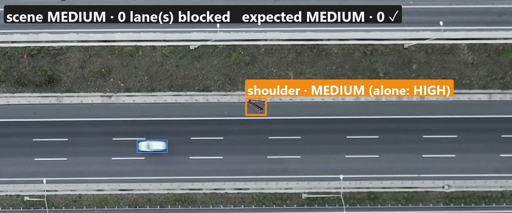
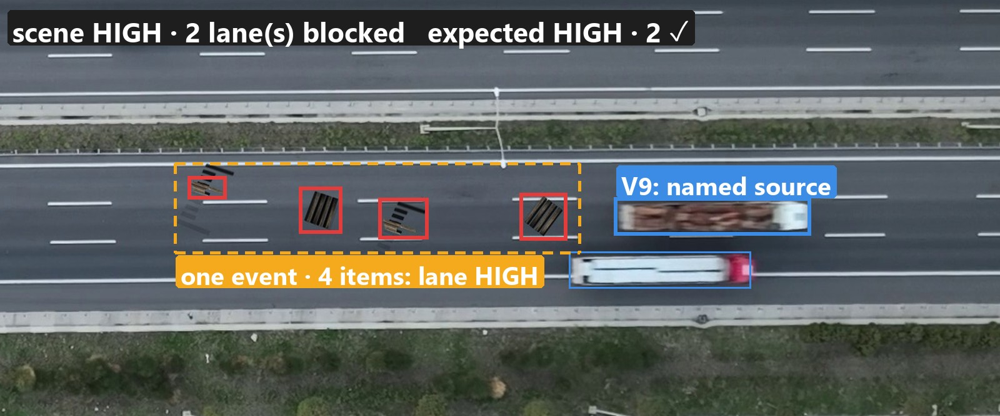
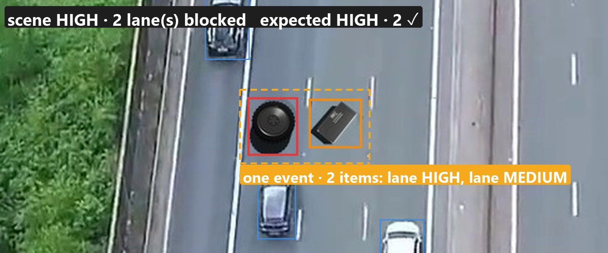
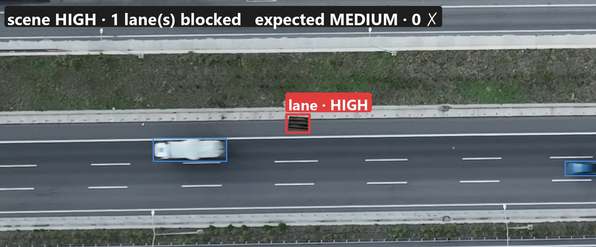

<!-- class: title -->

Stage report · 27 September 2026

# UAV-VisualSurv

Highway hazard perception from a drone: connecting the chain from seeing to risk, and comparing three architectures

???
This stage had two aims: first, connect the whole chain from a drone frame to a risk judgement; second, compare three ways of running it. The deck follows that order: what we built, what it looks like on real frames, and how the three compare in time, accuracy and hardware.

---

Overview

# This stage: connect the chain, compare the architectures

<h2>① Chain connected end to end · all 30 test frames</h2>

UAV frame

→

See

road + every object

vehicles <b>95%</b> debris <b>90%</b>

→

Identify

what is it

debris named A <b>56%</b> B <b>64%</b>

→

Context gate

drop false alarms

false alarms to risk A 34 → <b>1</b> B 23 → <b>0</b>

→

Assess risk

level + reason

false alarms rated high A <b>1</b> B <b>0</b>

→

Scene analysis

add-on (C)

lane vs shoulder <b>24/25</b> spills grouped <b>4/4</b>

→

Decide · Act next stage

<h2>② Three architectures compared</h2>

A · local Qwen3.5-2B

offline · free · <b>58 s</b> / frame

B · GPT-5.4 (API)

best accuracy · <b>28 s</b> / frame · $0.036

C · B + scene analysis

relational judgement · +2.4 s · +$0.007

30 / 30

test frames run end to end: frame → risk level + reason

0

false alarms rated high risk with the gate (B, C)

84%

of A's time spent identifying boxes: the bottleneck

???
The first goal is met: every stage runs on all 30 test frames, from the raw frame to a risk level with a written reason. The numbers under each block are the headline result of that stage. Detection finds 95% of vehicles and 90% of debris. The VLM names 56% of debris correctly locally and 64% with GPT-5.4. The context gate is what makes the output trustworthy: false alarms reaching the risk step drop from 34 to 1 locally and from 23 to 0 with GPT-5.4. For the second goal, A runs fully offline but takes about a minute per frame; B is twice as fast and more accurate but needs the API; C adds a scene-level judgement for a small extra cost. The next stage, decision and execution, is greyed out on the right.

---

Setup · dataset

# Real UAV motorway frames + rendered 3D debris

4 open-motorway locations30 test frames · fixed30 dev frames · all tuning342 vehicles · hand-checked1 debris object per test frameleave-one-location-out scoring

???
No public dataset has UAV imagery of open motorways with labelled debris, so we built one. The background is a real drone video frame. The debris is a 3D model from Sketchfab, rendered in Blender and placed at its real-world size using a per-location ground resolution calibrated on real cars. Debris labels come from the render itself, so they are pixel-exact; the 342 vehicle labels were proposed by Grounding DINO and every one was checked by hand. All settings are chosen on a separate development set, and learned parts are always tested on a location they never saw.

---
<!-- class: arch -->

Setup · architectures

# One chain, three architectures

UAV frame RGB · up to 4K

→

① See

Objective 1 · class-agnostic

Road segmentation <i>SegFormer-B2 · AeroScapes</i>

↓

Object detection <i>OWLv2 objectness · tiled</i>

↓

Re-scoring + road filter <i>logistic probe</i>

out: boxes + features

→

② Identify

what each box is

VLM: describe → 1 of 16 categories <i>two crops + size in metres</i>

↓

Physics check <i>category must fit the size</i>

out: name + category

→

③ Context gate

remove false alarms

cut by frame edge

&gt; 12.5 m from traffic

detector: not debris <i>3-class probe</i>

part of a vehicle <i>geometry · VLM check</i>

out: hazard candidates

→

④ Assess risk

per object

VLM: wide view + facts <i>size · distance to traffic</i>

↓

reason → level <i>high · medium · low</i>

out: risk + reason

→

⑤ Scene analysis

add-on · C only

whole frame, numbered <i>overview + close views + facts</i>

↓

lane / shoulder · events <i>lanes blocked · action</i>

out: scene risk + action

<table class="mx">
<tr><th style="width:15%"></th><th>① See</th><th>② Identify</th><th>③ Context gate</th><th>④ Assess risk</th><th>⑤ Scene analysis</th></tr>
<tr><td><b>A</b> · local</td><td class="gpu">local GPU</td><td class="gpu">Qwen3.5-2B 4-bit · local</td><td class="cpu">CPU (+ Qwen check)</td><td class="gpu">Qwen3.5-2B · local</td><td style="text-align:center">–</td></tr>
<tr><td><b>B</b> · API</td><td class="gpu">local GPU</td><td class="api">GPT-5.4 · API</td><td class="cpu">CPU (+ GPT check)</td><td class="api">GPT-5.4 · API</td><td style="text-align:center">–</td></tr>
<tr><td><b>C</b> · B + add-on</td><td class="gpu">local GPU</td><td class="api">GPT-5.4 · API</td><td class="cpu">CPU (+ GPT check)</td><td class="api">GPT-5.4 · API</td><td class="api">GPT-5.4 · API</td></tr>
</table>

local GPU CPU cloud API VLM, per architecture (table)

???
The main flow runs left to right; inside each block is the sub-flow and the model it uses. Objective 1 is shared by all three architectures: a drone-view road segmenter, then OWLv2's objectness score, which finds objects without being told their class, then a small learned re-scorer. Identification asks a vision-language model to describe each box and choose a category, and a physics check rejects answers that cannot match the measured size. The context gate applies four checks that only ever remove candidates. The risk step writes its reason before the level. The table underneath shows the only differences: A runs the language model locally, B and C call GPT-5.4, and only C adds the scene-analysis block, which is an add-on.

---

Demo · architecture A

# A · local Qwen3.5-2B

high medium removed by gate missed vehicle

✓ tyre found · HIGH · truck cut by frame edge removed

✓ small tyre found · HIGH

✗ lorry cab → 'barrel' · HIGH · false alarm reaches the alert

✗ fridge → 'roadside structure' · hazard missed

???
Four test frames, the same four for B on the next slide. Top row: what works. The tyre is found and rated high, and a truck cut by the frame edge is removed by the gate instead of raising an alarm. Even a small tyre in a busy lane is found. Bottom row: the weaknesses of a 2-billion-parameter model. It calls the red cab of an articulated lorry a barrel, and when the gate asks whether it is part of the lorry, it says no, so a false alarm is rated high. It also misreads a fridge seen from above as a roadside structure, so a real hazard is missed.

---

Demo · architecture B

# B · GPT-5.4

high medium removed by gate missed vehicle

✓ tyre found · HIGH

✗ small tyre → 'roadside structure' · missed

✓ lorry cab removed · GPT: "part of the vehicle"

✓ fridge found · HIGH · but it lies on the shoulder

???
Same frames with GPT-5.4. It fixes both of A's failures: asked by the gate, it confirms the red box matches the lorry's cab, so no false alarm; and it names the fridge correctly. But it is not uniformly better: it misses the small tyre that A found, calling it a roadside post. And it judges each object on its own crop, so the fridge is rated high although it actually lies across the edge line on the hard shoulder. That last point is what the scene-analysis add-on addresses.

---

Demo · add-on

# C · scene analysis: the frame judged as a whole

23 scene-relation frames · lane / shoulder / spill / blockage / clear · answers fixed before running

✓ shoulder object: HIGH alone → MEDIUM · "shoulder clearance"

✓ 4 planks → one spill from lorry V9 · 2 lanes · "close lanes"

✓ tyre + fridge side by side → 2 lanes blocked

✗ planks on the shoulder judged "in lane" · HIGH, expected MEDIUM

???
This is the add-on. To test it we built a small scene-relation set where the right answer depends on relations: the same object in a lane or on the hard shoulder, a load strewn behind a lorry, or two objects blocking adjacent lanes; the expected answers were written down before any model ran. C sees the whole frame with every candidate numbered. It moves a ladder on the shoulder from high to medium and asks for a shoulder clearance instead of a lane closure. It groups four planks into one spilled load, names the open-load lorry as the likely source and counts two blocked lanes. It is not always right: here it puts planks on the shoulder into the lane.

---

Evaluation

# Time, accuracy and GPU in one table

<table class="ev">
<tr><th style="width:44%"></th><th>A · local Qwen</th><th>B · GPT-5.4</th><th>C · B + scene add-on</th></tr>
<tr class="g"><td colspan="4">Inference time · s per frame · 30 test frames · RTX 3050 Ti (4 GB)</td></tr>
<tr><td>road segmentation</td><td class="n">0.32</td><td class="n">0.32</td><td class="n">0.32</td></tr>
<tr><td>object detection (OWLv2)</td><td class="n">4.33</td><td class="n">4.33</td><td class="n">4.33</td></tr>
<tr><td>re-scoring</td><td class="n">&lt; 0.01</td><td class="n">&lt; 0.01</td><td class="n">&lt; 0.01</td></tr>
<tr><td><b>identification (VLM, per box) · bottleneck</b></td><td class="n bn">49.2</td><td class="n bn">22.0</td><td class="n bn">22.0</td></tr>
<tr><td>context gate</td><td class="n">0.09</td><td class="n">0.13</td><td class="n">0.13</td></tr>
<tr><td>risk assessment (VLM)</td><td class="n">4.45</td><td class="n">≈ 1.3</td><td class="n">≈ 1.3</td></tr>
<tr><td>scene analysis (add-on)</td><td class="n">–</td><td class="n">–</td><td class="n">2.4</td></tr>
<tr><td><b>total</b></td><td class="n"><b>58.4</b></td><td class="n best">≈ 28</td><td class="n"><b>≈ 30.5</b></td></tr>
<tr class="g"><td colspan="4">Accuracy · 30 test frames</td></tr>
<tr><td>detection: vehicles · debris · precision</td><td class="span" colspan="3">95.2% · 90.0% · 84.1% (shared)</td></tr>
<tr><td>debris named correctly</td><td class="n">56%</td><td class="n best">64%</td><td class="n best">64%</td></tr>
<tr><td>vehicles named correctly</td><td class="n">96.0%</td><td class="n">96.4%</td><td class="n">96.4%</td></tr>
<tr><td>false alarms removed by the gate · real debris lost</td><td class="n">33 · 0</td><td class="n">24 · 0</td><td class="n">24 · 0</td></tr>
<tr><td>false alarms rated high</td><td class="n">1</td><td class="n best">0</td><td class="n best">0</td></tr>
<tr class="g"><td colspan="4">Accuracy · 23 scene-relation frames (add-on test)</td></tr>
<tr><td>scene risk correct</td><td class="n">16 / 23</td><td class="n">16 / 23</td><td class="n best">17 / 23</td></tr>
<tr><td>lane vs shoulder · spill grouped · lanes blocked</td><td class="n">–</td><td class="n">–</td><td class="n">24/25 · 4/4 · 16/23</td></tr>
<tr class="g"><td colspan="4">GPU memory · peak</td></tr>
<tr><td>Objective 1 pass · VLM pass</td><td class="n">2.19 GB · 1.97 GB</td><td class="n">2.19 GB · cloud</td><td class="n">2.19 GB · cloud</td></tr>
<tr><td>all models loaded at once</td><td class="n bn">4.05 GB &gt; 4 GB card</td><td class="n">2.19 GB</td><td class="n">2.19 GB</td></tr>
<tr class="g"><td colspan="4">Deployment</td></tr>
<tr><td>API cost per frame · runs offline</td><td class="n best">$0 · yes</td><td class="n">$0.036 · no</td><td class="n">$0.043 · no</td></tr>
</table>

???
Everything in one table. Time: the bottleneck is identification, one VLM call per box and about thirteen boxes per frame, mostly ordinary vehicles; it is 84% of A's time and 78% of B's. Detection plus the gate costs under five seconds. Accuracy: detection is shared; B names debris best and, with C, is the only one with no false alarm rated high on the test set. On the scene-relation set C is only one frame better than A and B on the overall level, but it is the only one that can say lane or shoulder, group a spill and count blocked lanes. GPU: A only fits the 4 GB card if models are loaded one stage at a time; B and C need only the detector on the device. The price is an API bill of about four cents per frame and no offline operation.

---
<!-- class: big -->

Takeaways

# Where we stand, what comes next

<h2>This stage</h2>
<ul>
<li>✓ chain connected: frame → objects → identity → gate → risk + reason</li>
<li>✓ "no false alarm rated high": met by B and C on the test set</li>
<li>B: best accuracy and speed today</li>
<li>A: offline and free, but slow</li>
<li>C: add-on for relational decisions</li>
</ul>

<h2>Next stage</h2>
<ul>
<li>decide + act: lane signals, message signs</li>
<li>bottleneck: identify only unclear boxes, in parallel</li>
<li>small-object detection (pallets ≈ 22 px)</li>
<li>object size from altitude + focal length</li>
</ul>

???
To close: the chain now runs end to end, and the gate makes its alerts trustworthy with GPT-5.4. For a demonstration, B is the best choice today; A matters for an offline, private product; C is a useful add-on when the control room needs to know which lanes to close and whether several objects are one incident. The next stage is the decision and execution step. On the perception side, the clear target is identification time, for example by skipping boxes the detector is already sure are vehicles and by running calls in parallel, and better detection of small objects.
