# UAV-VisualSurv: Stage Report

Highway hazard perception from UAV imagery: detection, identification and risk assessment.
Stage report, 26 September 2026.

## Overview

**Problem.** A safety-patrol drone over a motorway should find every vehicle and
every piece of fallen debris, say what each object is, and judge how dangerous
the scene is. No public dataset combines UAV imagery, open motorways and labelled
debris.

**Method.** We built a synthetic benchmark by rendering 3D debris into real UAV
motorway footage. Perception (Objective 1) is a class-agnostic two-stage detector:
road segmentation, then OWLv2 objectness with a learned re-scorer. Assessment
(Objective 2) passes each detection to a vision-language model (VLM) for
identification and a per-object risk level with a written reason. A rule-based
context gate sits between the two and removes false alarms using each candidate's
surroundings. We compare three architectures:

- **A** runs every step locally on a 4 GB laptop GPU, with Qwen3.5-2B as the VLM.
- **B** replaces the local VLM with GPT-5.4.
- **C** adds one scene-level analysis per frame to B.

**Findings.**

1. **Detection meets its targets.** On held-out frames it finds 95.2% of
   vehicles and 90.0% of debris, at 84.1% precision.
2. **The context gate enforces "no false alarm rated high risk".** False
   alarms reaching the risk step fall from 34 to 1 with A and from 23 to 0
   with B, and no real debris is removed.
3. **Identification is the bottleneck for accuracy and for time.** The VLMs
   name 56% (A) and 64% (B) of debris correctly, and identification takes 84%
   of A's 58 s per frame.
4. **Scene-level analysis (C) adds relational judgements.** It tells a lane
   from the hard shoulder (24 / 25) and groups a spilled load as one event
   (4 / 4). Its overall risk level improves only slightly on A and B
   (17 vs 16 of 23 scenes), because detection and identification errors
   upstream limit what it sees.

## 1 Setup

### 1.1 Datasets

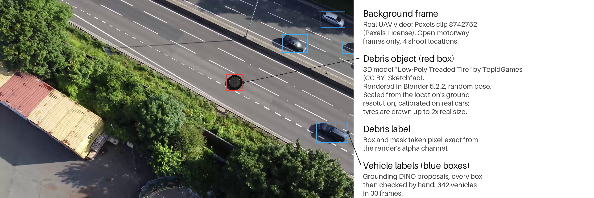

Figure 1. How a benchmark frame is made: a real UAV frame, a rendered 3D object
placed at calibrated real-world scale, and labels that need no manual drawing for debris.

- **Test set.** 30 frames from 4 open-motorway locations, each with one
  rendered debris object and 342 hand-checked vehicle labels. It stays fixed
  and is never used to choose settings.
- **Development set.** 30 other frames from the same locations with 90
  rendered objects. Every threshold, prompt and rule is chosen here.
- **Held-out scoring.** Learned components are scored leave-one-location-out.
- **Placement.** Debris is placed on the road mask, near real traffic, at the
  location's calibrated scale.
- **Scene-relation set.** 23 test and 8 development frames in which the correct
  risk depends on relations between objects (Figure 2). The expected answer of
  every frame was fixed in the build script before any model was run. It
  follows the same risk rubric the models are given: a rigid object in a
  running lane is *high*; a large object on the hard shoulder is *medium*.

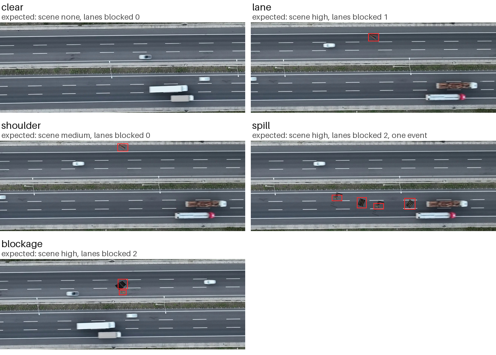

Figure 2. The five variants of one scene-relation background (placed objects boxed
in red). Lane lines are fitted per frame; the shoulder object is the lane object moved sideways.

### 1.2 Model architectures

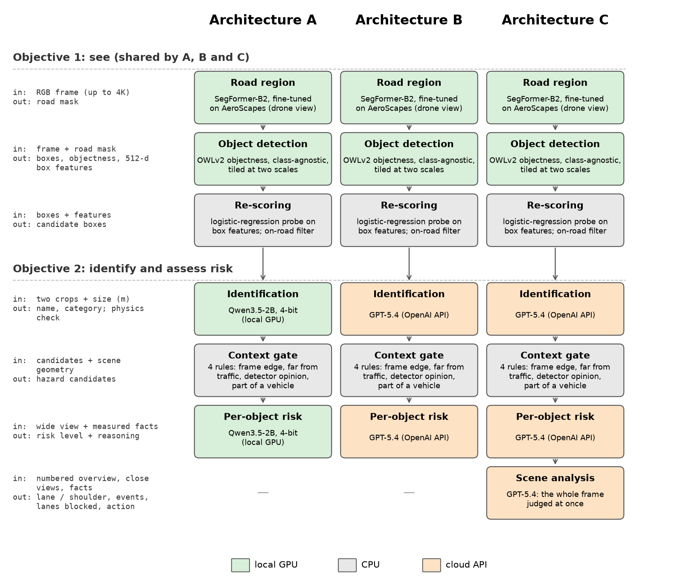

Figure 3. The three architectures side by side. Objective 1 is identical in all
three; A and B differ only in the VLM, and C adds a scene-level analysis to B.

- **Road region.** SegFormer-B2 fine-tuned on AeroScapes (drone view). Its mask
  is closed and dilated at quarter resolution.
- **Object detection.** OWLv2 (base, patch 16) objectness score on tiles at two
  scales, without class prompts, so unseen object types can still be found.
- **Re-scoring.** A logistic-regression probe on the objectness logit and the
  512-d box embedding separates real objects from road texture. Boxes need at
  least 50% road around them.
- **Identification.** The VLM sees a context crop and an enlarged crop plus the
  box size in metres. It describes the object, then picks one of 16
  categories. A *physics check* rejects any category that cannot have the
  measured size and asks again.
- **Context gate.** A candidate is removed if any of four rules holds:
  1. it is cut by the frame edge;
  2. it lies more than 12.5 m sideways from every lane with traffic;
  3. a background / vehicle / debris probe on its OWLv2 feature rules out
     debris;
  4. it is part of a vehicle (by geometry, or confirmed by asking the VLM).
- **Per-object risk.** The VLM gets a wide view and measured facts (size,
  distance to the nearest vehicle) and writes a reason before the level
  (high / medium / low).
- **Scene analysis (C).** One call per frame with a numbered overview of all
  candidates and vehicles, a 20 m close view of each candidate and a fact
  table. It returns lane or shoulder per object, event groups with their
  source vehicle, lanes blocked, a scene risk and an action for the control
  room.

## 2 Demos

The same four frames for each architecture: (1) a lorry cab next to its trailer,
(2) a fridge lying across the edge line, (3) an object on the hard shoulder, (4) a spilled load.
Panels: input, road region and detections, identification and risk, and scene analysis (C only).
Boxes: blue vehicle; red, orange, yellow high, medium, low risk; green removed by the context gate.

### Architecture A: local Qwen3.5-2B

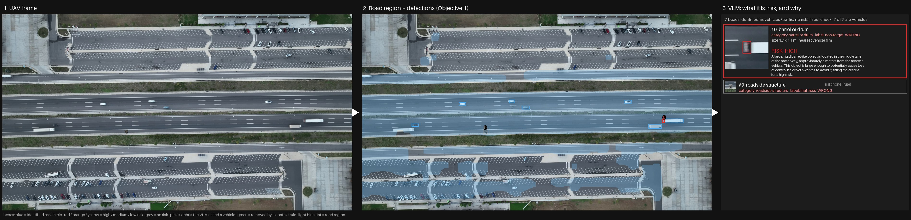

A1. <b>False alarm rated high.</b> The red cab of an articulated lorry is named a
barrel. The gate asks the VLM whether it is part of the lorry; Qwen answers "a loose object on the
road surface", so it reaches the risk step. The real debris, a mattress, is named a roadside structure.

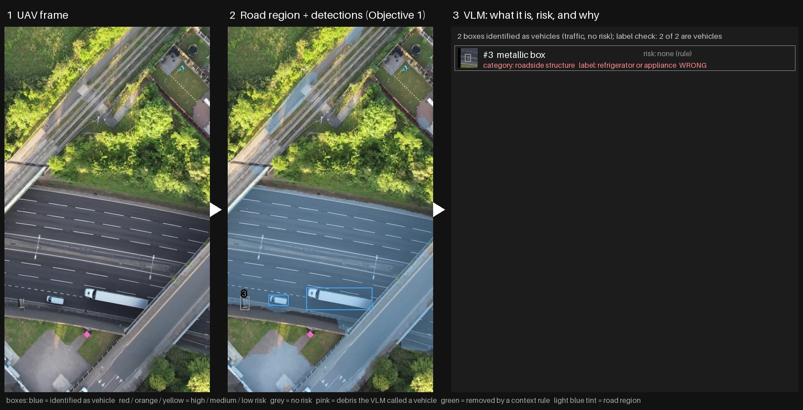

A2. <b>Missed hazard.</b> The fridge is named a roadside structure and never
reaches the risk step. A 2-billion-parameter model often misreads boxy debris seen from above.

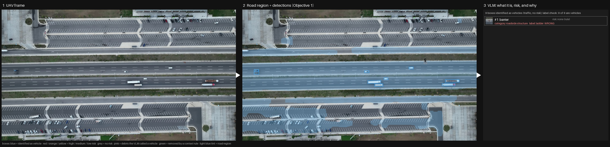

A3. <b>Shoulder object never seen as debris.</b> The ladder is named a roadside structure, so the scene is rated "none" where the answer is medium.

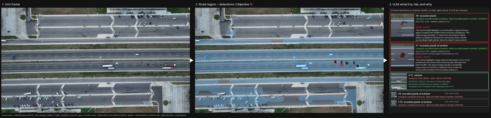

A4. <b>Half of the spill is missed.</b> Two of the four planks are named roadside structures; the other two are rated high as separate objects, with no link between them.

### Architecture B: GPT-5.4

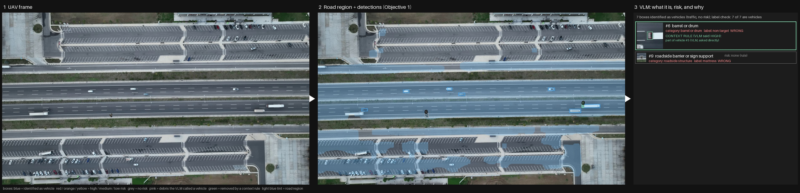

B1. <b>Same frame, no false alarm.</b> GPT-5.4 also names the cab a barrel, but
when the gate asks, it answers that the box "matches the vehicle cab", so the cab is removed. The
mattress is still missed.

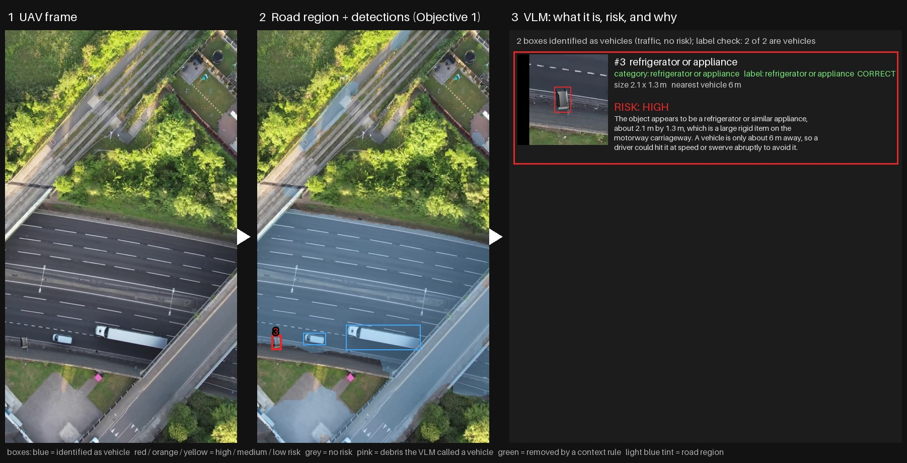

B2. <b>Correct name, context ignored.</b> The fridge is identified and rated high
on its own, although it lies across the edge line onto the hard shoulder.

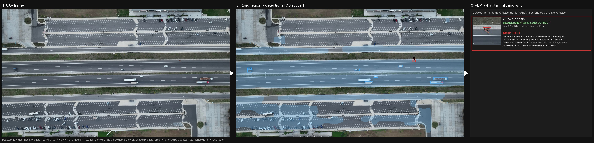

B3. <b>Shoulder object rated as if in a lane.</b> The ladder is on the hard
shoulder; judged from its own crop it is rated high, where the rubric says medium.

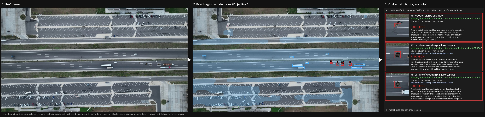

B4. <b>Four independent alarms.</b> Every plank is identified and rated high, but
nothing links them to each other or to the open-load lorry ahead of them.

### Architecture C: GPT-5.4 + scene analysis

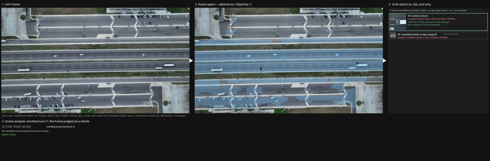

C1. <b>Clean frame stays clean.</b> With no candidate left after the gate, the scene
is "none" by rule and no scene call is made (no cost, no latency).

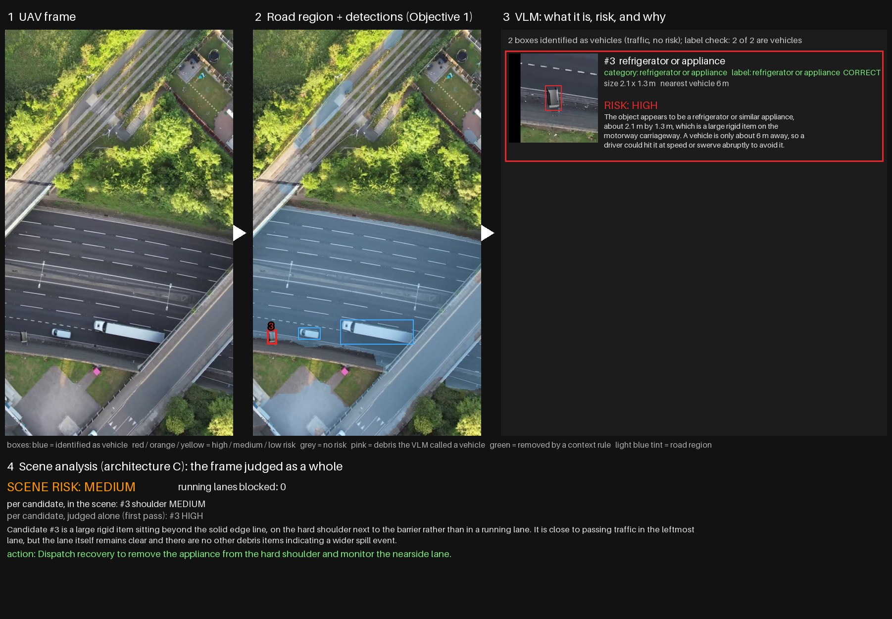

C2. <b>Position changes the risk.</b> "Beyond the solid edge line, on the hard
shoulder next to the barrier": high becomes medium. The only level C changed on the test set.

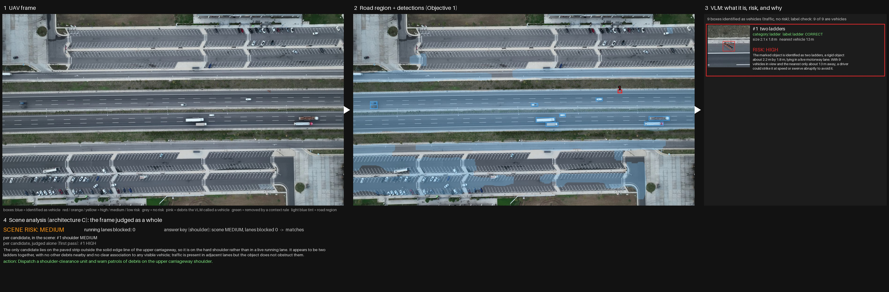

C3. <b>Shoulder recognised.</b> The ladder is placed "outside the solid edge line";
the scene risk is medium and the action is a shoulder clearance, not a lane closure.

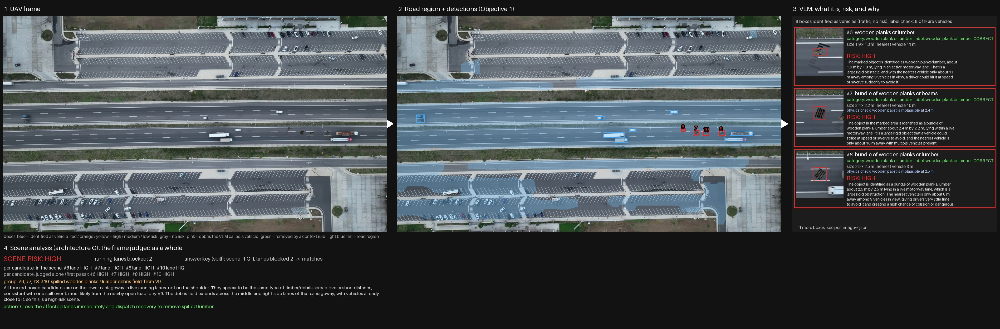

C4. <b>One event, one source.</b> The four planks are grouped as a spilled load,
"most likely from the nearby open-load lorry V9"; two lanes blocked; action: close them.

## 3 Evaluation

### 3.1 Inference time

Mean seconds per frame over the 30 test frames, RTX 3050 Ti Laptop (4 GB), staged
mode: Objective 1 on all frames first, then the VLM stages.

| step | A (local) | B (API) | C (API) |
|---|---|---|---|
| road segmentation | 0.32 | 0.32 | 0.32 |
| object detection (OWLv2) | 4.33 | 4.33 | 4.33 |
| re-scoring | < 0.01 | < 0.01 | < 0.01 |
| **identification (VLM, per box)** | **49.19** | **22.0** | **22.0** |
| context gate | 0.09 | 0.13 | 0.13 |
| per-object risk (VLM) | 4.45 | ≈ 1.3 | ≈ 1.3 |
| scene analysis (VLM, per frame) | – | – | 2.4 |
| **total** | **58.4** | **≈ 28** | **≈ 30.5** |
| API cost per frame | none | US$0.036 | US$0.043 |

- **Identification is the bottleneck.** It takes 84% of A's time and 78% of
  B's. It is one VLM call per box, about 13 boxes per frame, and most boxes
  are ordinary vehicles.
- **Detection plus the gate costs about 4.7 s per frame.** The gate itself
  costs 0.1 s: its rules are geometry, and its probe reuses detector features.
- **C adds 2.4 s and US$0.007 per frame.** The scene call is made only when a
  candidate remains (21 of 30 frames), at about 3.5 s each.
- **B and C time is network time.** The calls are made in sequence and could
  run in parallel.

### 3.2 Accuracy

**Fixed test set (30 frames).** Objective 1 is shared by all three
architectures. On held-out halves at IoU > 0.1 it finds 95.2% of vehicles and
90.0% of debris at 84.1% precision; at IoU > 0.5 the figures are 92.8%, 80.0%
and 81.3%. The table below covers Objective 2 on the 414 boxes Objective 1
keeps.

| | A | B | C |
|---|---|---|---|
| debris named with the right category (of 25) | 56% | 64% | 64% |
| vehicles named "vehicle" (of 329) | 96.0% | 96.4% | 96.4% |
| false alarms removed by the context gate | 33 | 24 | 24 |
| real debris removed by the context gate | 0 | 0 | 0 |
| false alarms reaching the risk step | 1 | 0 | 0 |
| false alarms rated high risk | 1 | 0 | 0 |
| debris boxes assessed for risk (of 27) | 22 | 21 | 21 |

**Scene-relation set (23 frames).** A and B's scene risk is their highest
per-object risk.

| | A | B | C |
|---|---|---|---|
| scene risk correct | 16 / 23 | 16 / 23 | 17 / 23 |
| clear / lane / shoulder / spill / blockage | 5/5, 3/5, 0/4, 4/4, 4/5 | 5/5, 3/5, 0/4, 3/4, 5/5 | 5/5, 3/5, 1/4, 3/4, 5/5 |
| false alarms rated high | 2 | 1 | 1 |
| lane or shoulder correct, per object | – | – | 24 / 25 |
| spilled items grouped as one event | – | – | 4 / 4 |
| lanes blocked exactly right | – | – | 16 / 23 |

- **B names objects best, and B and C meet "no false alarm rated high" on
  the test set.** A misses it once and misnames most boxy debris. On the
  scene set all three rate one vehicle part high (named a barrel), and A also
  rates a whole lorry named a pallet high.
- **C's added value is structure, not the headline level.** It judges
  position and grouping correctly, and it corrected one of the two shoulder
  objects that reached it. But 5 of 33 placed objects were missed by detection (mainly
  pallets of about 22 px) and 3 more were misnamed before the scene step.
  Those errors limit C as much as B.

### 3.3 GPU memory (peak allocated)

| | A | B | C |
|---|---|---|---|
| Objective 1 pass | 2.19 GB | 2.19 GB | 2.19 GB |
| VLM pass | 1.97 GB | none (cloud) | none (cloud) |
| all models loaded at once | 4.05 GB, above the 4 GB card | 2.19 GB | 2.19 GB |

A fits the card only in staged mode. A live, frame-by-frame system with A needs
a smaller detector or VLM, or a larger GPU. B and C need only Objective 1 on
the device.

## 4 Limitations and next steps

- **Upstream errors decide what reasoning can see.** The next gains are in
  small-object detection and identification, not in more reasoning.
- **Synthetic debris.** Dev and test share 22 debris models, and some renders
  (fridges especially) look artificial. The scene-relation set is small (23
  frames, mostly one camera).
- **Calibration.** Ground resolution comes from a per-location, car-based
  calibration. One location's calibration appears 30% too high (its lanes
  measure 2.4 m). A deployed drone would use altitude and focal length
  instead.
- **Deployment trade-off.**
  - **A** is offline, private and free, but slow (58 s per frame).
  - **B and C** are faster and more accurate, but need a network link, send
    crops to a provider and cost about US$0.04 per frame.
  - **Licences.** The road model's weights and data are licensed for research
    only.

References: SegFormer (Xie et al., NeurIPS 2021); AeroScapes (Nigam et al., WACV 2018);
OWLv2 (Minderer et al., NeurIPS 2023); Grounding DINO (Liu et al., ECCV 2024); Qwen3.5 (Alibaba
Qwen team, 2026); GPT-5.4 (OpenAI); Blender 5.2; Pexels videos 8742752, 12306893, 12571926,
19851623; 3D debris models from Sketchfab under CC BY (credits in the dataset manifest).
Code and results: github.com/jhim-derek-chen/UAV-VisualSurv.

